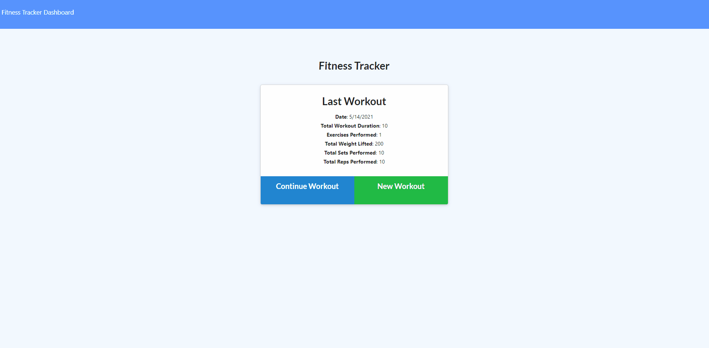

# Fitness-Tracker

## Summary
This software contains an application called fitness tracker. In this application the user is able to keep track of their daily workouts. When the user loads the application on the browser, the user loads the information for the last workout, if there is one. This information includes the date, total workout, exercises performed, total weight lifted, total sets performed, and total reps performed. On this page, the user is able to start a new workout or continue the last workout. If the user decides to start a new workout, the application then prompts the user for some information about the workout. If the user selects to continue the workout, the application then prompts the user to input some information. 

The application also contains a dashboard page where it displays charts of the workout data. The charts that are displayed are workout duration in minutes, pounds lifted, and exercises performed. The pie charts display the name of the pie charts with the reps as well. This application will definitely help the user keep track of all the data associated with their workout routine.

## Site


## Code Snippet
This code snippet represents the put route that was used to update the workout. This code snippet is important because I had to figure out 'findByIdAndUpdate' that is with the mongo database. 

```javascript
router.put("/api/workouts/:id", (req, res) => {
    Workout.findByIdAndUpdate({
        _id: req.params.id
    },
        {
            $push: { exercises: req.body }
        }
    )

        .then(dbWorkout => {
            res.json(dbWorkout);
        })
        .catch(err => {
            res.status(400).json(err);
        });
});
```
## Technologies Used

* HTML - Used for making the website
* CSS - Used to style the site
* Javascript - Used to append elements to the DOM
* Bootstrap - Used to make the css framework
* Git - Used for pushing up to github
* GitHub - Used to store the repository for the application
* Router - used for routes
* MongoDB - The database
* Mongoose - Package used with MongoDB

## Repository Link
https://github.com/javimarashall/Fitness-Tracker

## Deploy Link
https://still-escarpment-29222.herokuapp.com/?id=609f097cae083800155038b3


## Personal Links
[Github](https://github.com/javimarashall)<br>
[Linkedin](https://www.linkedin.com/in/javier-mondragon-7b471719b/)